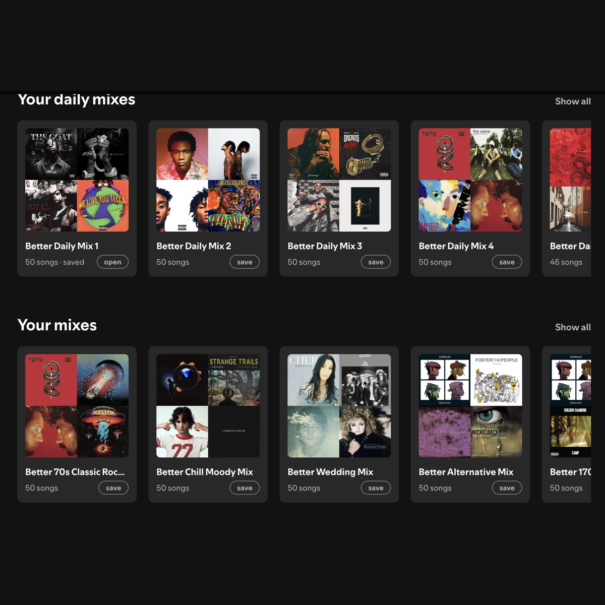

# Better Mix

**Have you ever felt that Spotify's mixes are lacking?** 

Better Mix takes every mix Spotify makes for you, asks Spotify what fits it, then throws out
everything you already listen to — your library, your recent plays, the mix's
own artists. What's left is popular music by artists you *don't* play, ranked
by popularity, with a few songs you know spread through it.



## Install

Copy one folder, run two commands.

**1.** Download this repo — the green **Code** button above, then **Download
ZIP** — and unzip it.

**2.** Copy the folder named `better-mix` into Spicetify's `CustomApps` folder.
Keep the name exactly as it is; Spotify uses it as the page's address.

| | |
|---|---|
| macOS / Linux | `~/.config/spicetify/CustomApps/` |
| Windows | `%APPDATA%\spicetify\CustomApps\` |

Not sure where that is? Run `spicetify path userdata` and look for
`CustomApps` inside.

**3.** In a terminal, run:

```bash
spicetify config custom_apps better-mix
spicetify apply
```

Spotify will restart. **Open your Home page once** so Better Mix can see which
mixes Spotify makes for you — it builds them in the background over a few
minutes, and the rows show a counter while it works. After that it runs on its
own.

<details>
<summary>Prefer the command line?</summary>

```bash
git clone https://github.com/noahtberger/spicetify-better-mix.git
cp -r spicetify-better-mix/better-mix "$(spicetify path userdata)/CustomApps/better-mix"
spicetify config custom_apps better-mix
spicetify apply
```

</details>

**Updating later:** download again, copy the folder over the old one, and run
`spicetify apply`.

## Using it

- **Home rows** replace Spotify's mix shelves: your daily mixes, then your
  mixes. Hover a card to play; click for its page; **Show all** lists every
  mix built.
- **A mix page** looks like a playlist — play, shuffle, save as a real playlist
  (which then syncs to your phone), rebuild, search and sort.
- **Right-click any playlist** for a one-off better mix of it.
- **Profile menu**: turn the automatic builds off, or put Spotify's rows back.

Mixes live in Spotify on this computer, not in your Spotify account, so they
won't show up on your phone. Save one and it becomes a normal playlist that
does.

## How it decides

For each of Spotify's mixes it asks their recommender what fits, then drops
every candidate you've played recently, everything in your library, and
anything by an artist already in that mix. Survivors are ranked by popularity,
capped at two per artist, and a track already used in another mix is penalised
so the same few songs don't fill everything. A handful of songs you know are
spliced through so it doesn't open like a stranger's playlist.

Every track records which rule let it in, visible on hover in the tracklist.

---

Thanks for using Better Mix. If you like it, please star the repo.
